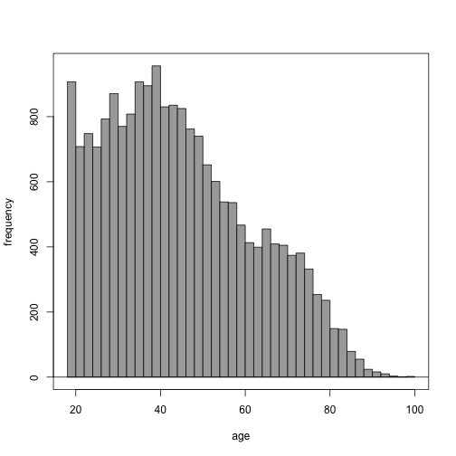

통계학실험 2015. 09. 23
==========

## 2007-10927 컴퓨터공학부 최용철

 행동위험요인 감시시스템(The Behavioral Risk Factor Surveillance System)은 매년 미국
에서 시행되는 대규모 전화 설문 조사이다. 이 조사에서는 응답자들의 현재 건강 상태 및 그
들의 건강과 관련된 생활 습관 등을 조사한다. 이 조사에 관한 자세한 내용은 BRFSS 의 웹
사이트에서 확인할 수 있다. (http://www.cdc.gov/brfss)  
 주어진 자료는 2000년도에 시행된 20,000명의 BRFSS 조사 데이터의 일부이며 전체 200개
이상의 항목 중에서 간추린 9개의 항목을 포함하고 있다. 각 변수에 대한 설명은 다음과 같
다.  
 - genhlth : 범주형 자료, 전반적인 건강상태 (excellent/very good/good/fair/poor)
 - exerany : 범주형 자료, 지난달의 운동 여부 (1=yes, 0=no)
 - hlthplan : 범주형 자료, 건강보험 가입 여부 (1=yes, 0=no)
 - smoke100 : 범주형 자료, 현재까지 최소 100개피 이상의 담배 흡연 여부 (1=yes, 0=no)
 - height : 숫자형 자료, 신장 (inch)
 - weight : 숫자형 자료, 체중 (pound)
 - wtdesire : 숫자형 자료, 응답자가 생각하는 본인의 이상적인 체중 (pound)
 - age : 숫자형 자료, 나이 (year)
 - gender : 범주형 자료, 성별 (m=남성, f=여성)

## Homework (1/2)

### 예제 1. genhlth 변수에 대해 적절한 방법을 이용하여 요약해보자. 범주형 자료의 경우에는 어떠한 요약 방법을 사용할 수 있는가?

> Answer : [통계] - [요약] - [빈도 분포]


```r
local({
  .Table <- with(cdc, table(genhlth))
  cat("\ncounts:\n")
  print(.Table)
  cat("\npercentages:\n")
  print(round(100*.Table/sum(.Table), 2))
})
```

```
## 
## counts:
## genhlth
## excellent very good      good      fair      poor 
##      4657      6972      5675      2019       677 
## 
## percentages:
## genhlth
## excellent very good      good      fair      poor 
##     23.29     34.86     28.38     10.10      3.38
```

### 예제 2. weight 변수에 대한 수치적 요약 값을 구해보자. 전체 응답자의 평균 몸무게는 얼마인가?

> Answer : 169.683


```r
numSummary(cdc[,"weight"], statistics=c("mean", "sd", "IQR", "quantiles"), quantiles=c(0,.25,.5,.75,1))
```

```
##     mean       sd IQR 0% 25% 50% 75% 100%     n
##  169.683 40.08097  50 68 140 165 190  500 20000
```

### 예제 3. weight 변수에 대한 수치적 요약을 성별에 따라 구해보자. 이를 위해 [통계]-[수치적 요약]-[집단별 요약]에서 성별을 집단별 요약 변수로 선택한다. 성별에 따른 평균 체중은 차이가 있는가? 성별에 따른 집단별 상자그림을 통해서도 이를 확인해 보자.

> Answer : 남자가 더 크다


```r
numSummary(cdc[,"weight"], groups=cdc$gender, statistics=c("mean", "sd", "IQR", "quantiles"), quantiles=c(0,.25,.5,.75,1))
```

```
##       mean       sd IQR 0% 25% 50% 75% 100% data:n
## m 189.3227 36.55036  45 78 165 185 210  500   9569
## f 151.6662 34.29752  42 68 128 145 170  495  10431
```


```r
Boxplot(weight~gender, data=cdc, id.method="y")
```

 

```
##  [1] "303"   "9558"  "11333" "13632" "15967" "18065" "1995"  "15720"
##  [9] "861"   "1279"  "2659"  "2944"  "13177" "6797"  "15190" "769"  
## [17] "4445"  "19319" "7160"  "4612"  "1492"  "2587"  "5778"  "13607"
## [25] "840"   "617"
```

### 예제 4. weight 변수와 wtdesire 변수의 산점도를 그려보자. 두 변수 사이에는 어떠한 관계가 존재한다고 보여지는가? 두 변수의 상관계수는 무엇은 나타내고 있는가?

> Answer : 두 변수는 상관이 있고(0.8), 대체로 자기 몸무게 근처의 몸무게를 희망한다


```r
scatterplot(wtdesire~weight, reg.line=lm, smooth=FALSE, spread=FALSE, id.method='mahal', id.n = 2, boxplots=FALSE, span=0.5, data=cdc)
```

 

```
## 10034 16874 
## 10034 16874
```


```r
cor(cdc[,c("weight","wtdesire")], use="complete")
```

```
##             weight  wtdesire
## weight   1.0000000 0.8000521
## wtdesire 0.8000521 1.0000000
```


### 예제 5. wtdesire 변수와 weight 변수의 차를 계산하여 새로운 변수 wdiff 를 만들어보자. wdiff 의 분포는 어떠한가? 수치적 요약과 그래프 요약을 통해 살펴보자. 이것이 의미하는 바는 무엇인가?

> Answer : 대체로 몸무게가 적은 사람은 몸무게가 늘길 원하고, 몸무게가 많은 사람은 줄어들기 원하며 평균치에서 멀어질 수록 diff 의 차이는 크다


```r
cdc$wdiff <- with(cdc, wtdesire-weight)
```


```r
numSummary(cdc[,"wdiff"], statistics=c("mean", "sd", "IQR", "quantiles"), quantiles=c(0,.25,.5,.75,1))
```

```
##      mean       sd IQR   0% 25% 50% 75% 100%     n
##  -14.5891 24.04586  21 -300 -21 -10   0  500 20000
```


```r
scatterplot(wdiff~weight, reg.line=lm, smooth=TRUE, spread=TRUE, id.method='mahal', id.n = 2, boxplots='xy', span=0.5, data=cdc)
```

 

```
## 10034 16874 
## 10034 16874
```

### 예제 6. age 변수를 이용하여 히스토그램을 그려보자. 그리고 구간의 수를 50, 100으로 바꿔가며 동일한 히스토그램을 그린 후 비교해보자.

> Answer : 20대 극초반에서 특이하게 응답자의 숫자가 크다


```r
with(cdc, Hist(age, scale="frequency", breaks="Sturges", col="darkgray"))
```

 


```r
with(cdc, Hist(age, scale="frequency", breaks=50, col="darkgray"))
```

 


```r
with(cdc, Hist(age, scale="frequency", breaks=100, col="darkgray"))
```

 

- (참고) 히스토그램은 자료의 형태를 파악하기 위한 쉬운 방법이지만 구간의 수가 달라짐에 따라 그 모양이 조금씩 달라질 수 있다.

## Homework (2/2)


```r
set.seed(1000)
```

### 1. 1부터 100 사이에서 40개의 정수를 임의로 선택하여 저장하자.


```r
x = 1:100
y = sample(x, 40)
```

### 1-1. 예제 1에서 만들어진 벡터를 사용하여 5행 8열의 행렬을 생성하시오


```r
mat = matrix(data = y, nrow = 5, ncol = 8)
mat
```

```
##      [,1] [,2] [,3] [,4] [,5] [,6] [,7] [,8]
## [1,]   33    7   32   95   14   51   40   46
## [2,]   76   70   97   42   64   34    4    2
## [3,]   12   55   28   53   23   61   39   96
## [4,]   68   20   99   85    6   82   65   37
## [5,]   50   24   66   48   84    9   74   92
```

### 1-2. 예제 1에서 생성된 행렬에서 2행과 3행만을 추출하여 저장하시오.


```r
mat[c(2,3),]
```

```
##      [,1] [,2] [,3] [,4] [,5] [,6] [,7] [,8]
## [1,]   76   70   97   42   64   34    4    2
## [2,]   12   55   28   53   23   61   39   96
```

### 1-3. 예제 1에서 생성된 행렬에서 (1,4,7,8)열을 추출하여 저장하시오.


```r
mat[,c(1,4,7,8)]
```

```
##      [,1] [,2] [,3] [,4]
## [1,]   33   95   40   46
## [2,]   76   42    4    2
## [3,]   12   53   39   96
## [4,]   68   85   65   37
## [5,]   50   48   74   92
```

### 1-4. 예제 1에서 생성된 행렬의 7번째 열의 평균과 분산을 구하시오.


```r
mean(mat[,7])
```

```
## [1] 44.4
```

```r
var(mat[,7])
```

```
## [1] 745.3
```

### 예제 2. 1부터 20 사이에서 1개의 숫자를 임의로 선택하여 저장하자. 이 숫자가 10 이상이면 “P”를 출력하고 10 미만이면 “NP”를 출력하는 코드를 작성해보시오


```r
if (sample(1:20, 1) >= 10) {print("P")} else {print("NP")}
```

```
## [1] "P"
```

### 예제 3. 1부터 20 사이에서 8개의 숫자를 임의로 선택하여 저장하자. 8개의 숫자들 각각에 대해 숫자가 10 이상이면 “P”를 출력하고 10 미만이면 “NP”를 출력하는 코드를 작성해보시오.


```r
for(i in sample(1:20, 8)){if (i>=10) {print("P")} else {print("NP")}}
```

```
## [1] "P"
## [1] "NP"
## [1] "P"
## [1] "P"
## [1] "P"
## [1] "P"
## [1] "NP"
## [1] "NP"
```


```r
load("/Users/charles/Documents/workspace/snu/StaticsExperiment/static/hw/cdc.RData")
```


